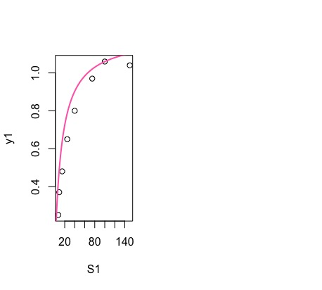
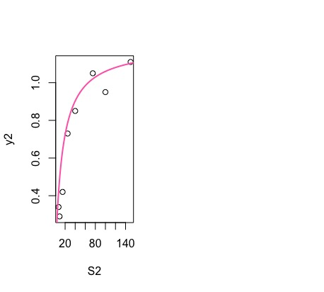

# Monod Model

The Monod equation is a mathematical model for the growth of microorganisms.

The growth of microorganisms in biological treatment can be described with this monod model:

y = θ1S/(θ2+S)+e

This model was transformed into a model that is linear with respect to some new parameters.

## Running this

1. Make sure you have R installed
2. Open the file in R studio
3. Run the script

## Results

### Reactor 1

### Reactor 2

